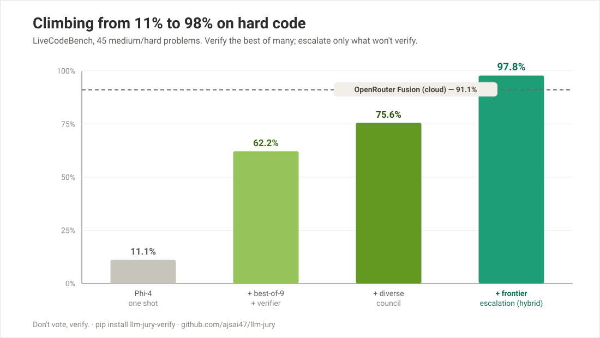
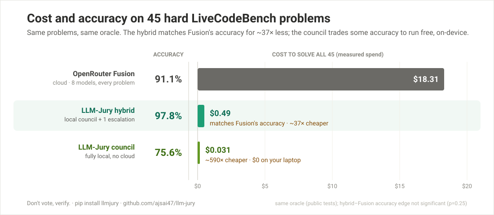

# Benchmarks

Head-to-head on the **same problems, judged by the same oracle**. Two honest headlines:

1. **The hybrid matches the cloud leader's accuracy — measured, full n=45.** On all 45
   LiveCodeBench problems, same oracle, the local-first hybrid scores **44/45 (97.8%)** vs
   OpenRouter Fusion's **41/45 (91.1%)**, for **~38× less money** ($0.49 vs $18.31). On this set
   the hybrid solves a *strict superset* of Fusion's problems — everything Fusion gets, plus three
   more — and loses none.
2. **What we still do *not* claim:** that the hybrid is *significantly* more accurate. +3 problems
   with zero losses is a clean sweep on the sample, but at n=45 it isn't statistically significant
   (McNemar exact p = 0.25). The honest claim is **parity-or-better at a fraction of the cost** —
   and the cost gap *is* decisive.

The numbers below, and the caveats that bound them, are why.

## The three configurations

| Config | What runs | Local | Private | Verified |
|---|---|---|---|---|
| **Council** | 3 small open models (phi-4, gemma-3-12b, llama-3.1-8b), verified best-of-9 | ✓ | ✓ | ✓ |
| **Hybrid** | Council, then escalate *only* the problems the verifier can't pass to **one** frontier model (best-of-4), re-verified | ✓ for ~75%; cloud for the hard ~25% | partial | ✓ |
| **OpenRouter Fusion** | Closed cloud: fans out to ~8 frontier models + a judge, on **every** problem | ✗ | ✗ | ✗ |

## Measured head-to-head — full LiveCodeBench (45 medium/hard problems)

Every problem, byte-identical oracle, real measured cost:

| Approach | Accuracy | 95% CI | Cost | Local | Private | Verified |
|---|---|---|---|---|---|---|
| **LLM-Jury hybrid** (council + 1 frontier escalation) | **44/45 (97.8%)** | [88.4%, 99.6%] | **$0.49** | ◐ | ◐ | ✓ |
| OpenRouter Fusion (closed, ~8-model panel + judge) | 41/45 (91.1%) | [79.3%, 96.5%] | $18.31 | ✗ | ✗ | ✗ |
| **LLM-Jury council** (small open council, local, no cloud) | 34/45 (75.6%) | [61.3%, 85.8%] | $0.031 · $0 local | ✓ | ✓ | ✓ |

- **The hybrid's correct set is a strict superset of Fusion's.** It wins 3 problems Fusion gets
  wrong (`abc311_c` medium, `abc312_e` hard, `abc314_f` hard), loses **zero**, and both miss
  exactly one genuinely brutal problem (`abc314_e` hard). Every problem Fusion solves, the hybrid
  also solves.
- **~38× cheaper, measured.** $0.49 (hybrid, all 45) vs $18.31 (Fusion, all 45). No extrapolation.
- **Statistical honesty:** a +3 / −0 sweep is a clean dominance on the sample, but McNemar's exact
  test gives two-sided **p = 0.25** — not significant at n=45. Read it as **the hybrid matched or
  beat Fusion on every problem here, at ~1/38th the cost**, with the accuracy edge itself below the
  significance bar. (Fusion by difficulty: medium 26/27, hard 15/18; hybrid: medium 27/27, hard 17/18.)

### Fairness disclosure (we gave Fusion the advantage)

Fusion's first full-45 pass left 5 problems incomplete — 2 hit a credit cap (402, never ran) and 3
returned **empty** output (a 200 with the answer truncated away at the 8000-token cap, yet still
charged). Counting truncations as capability failures would have *understated* Fusion. So we
re-ran all 5 at a **larger 16000-token budget** (double the baseline both systems otherwise used)
— and Fusion then completed all 5 and passed 4 of them. That extra budget went to the **competitor**,
not to us, and the hybrid still came out ahead. Gross Fusion spend was ~$19.9 including the
truncated runs and retries; the **$18.31** reported is the cost of the final response set used
(standard benchmark accounting).

## 12-problem head-to-head (the original direct subset)

The first 12 problems (abc301–303), where both systems went 12/12 — kept for continuity:

| Approach | Accuracy | Cost (12) |
|---|---|---|
| OpenRouter Fusion | 12/12 (100%) | $6.04 |
| **LLM-Jury hybrid** | 12/12 (100%) | **$0.169** |
| LLM-Jury council | 9/12 (75%) | $0.008 · $0 local |

The full-45 run above supersedes this slice; the n=12 cost ratio (~36×) is consistent with the
measured ~38× on 45.

## Hybrid escalation — how the 44/45 is built

The council solves 34/45 locally. The hybrid escalates **only the 11 it can't verify** to one
frontier model (DeepSeek V4-Pro, best-of-4), re-checked by the same oracle:

| Stage | Result | Cost |
|---|---|---|
| Council alone (local, verified best-of-9) | 34/45 (75.6%) | $0.031 · $0 local |
| **+ frontier escalation on the 11 failures** | **+10 recovered → 44/45 (97.8%)** | + $0.456 |
| **Hybrid total (all 45)** | **44/45 (97.8%)** | **$0.487** |

**34 solved locally** (free, private); **10 of the 11 council failures recovered** by one frontier
escalation; one genuine remaining failure (`abc314_e` — all 4 frontier samples returned real code,
none dropped; Fusion misses it too).

## Easy code — HumanEval+ (82 problems)

| Approach | Accuracy |
|---|---|
| **LLM-Jury** (small council + verifier) | **97.6%** |
| Frontier (DeepSeek) one shot | 97.6% |

On easier code where the small models are capable, the council **matches frontier** outright with
no escalation needed.

## Caveats — read these next to the numbers

These bound exactly what the headline means. They came out of an adversarial audit of our own
claims; we kept the ones the data forced us to keep.

1. **The accuracy edge is a clean sweep but not statistically significant.** 44/45 vs 41/45 is +3
   problems with 0 losses (Fusion-correct ⊆ Hybrid-correct), but McNemar's exact test gives
   p = 0.25 at n=45. Read it as parity-or-better, not a proven win. ~350 problems would be needed
   to resolve a gap this small.
2. **Point estimates carry intervals.** Hybrid 44/45 = 97.8% has a 95% Wilson CI of ~[88%, 100%];
   Fusion 41/45 = 91.1% has ~[79%, 97%]. The intervals overlap. Read points with bands.
3. **We gave Fusion a token-budget advantage on 5 problems.** After truncation/credit-cap on its
   first pass, 5 problems were re-run for Fusion at 16k tokens (vs the 8k baseline); this *helped*
   Fusion (4 of 5 then passed) and biases the comparison toward the competitor, not us.
4. **The oracle is public sample tests only.** Both systems are judged by the **same** oracle —
   the problem's public sample cases (1–4 per problem, mean 2.8; two problems have a single case).
   This is **not** AtCoder's hidden judge suite. "97.8%" and "91.1%" mean "passes the public
   samples," not "provably correct in competition." The leniency is **identical for both systems**,
   so the *comparison* is fair; only the absolute accuracy is inflated vs full hidden-test scoring.
5. **"Local" describes the product, not this run.** These numbers were measured with the council
   served via OpenRouter for reproducibility (measured council cost $0.031; a genuine local run is
   $0). The 75% "local" figure is an architectural property of local-capable models (Ollama:
   phi-4 / gemma-3-12b / llama-3.1-8b), not of the run that produced these dollars.
6. **Escalated problems leave the device.** The ~24% the council can't verify — disproportionately
   the hardest (7 of 11 are "hard") — are sent to a cloud frontier model. **"Local-first" is not
   "fully private."** The hybrid keeps most work local; it does not keep all of it local.
7. **Not sample-for-sample.** The hybrid spends best-of-9 (council) + best-of-4 (frontier on
   failures); Fusion is one shot per problem. The claim is **system-vs-system at the stated cost**,
   not per-sample parity.

*Footnote (verified non-issue):* the council arm scored whole-output `.strip()` while the hybrid
oracle is per-line; re-running all 855 cached council candidates under the strict per-line oracle
yields the **identical 34/45** — zero verdict flips, so no result depends on it. *Available upside
not claimed:* 9 of the 10 recoveries passed on the first frontier sample, so a sequential
early-stop escalation would cost less than the best-of-4 figure above; we report the higher
measured cost.

## What this means

Three jobs, three configurations:

- **Cheapest verifiable answers, fully local and private** → the **council** (75.6% on hard code
  for 3 cents, $0 local, nothing leaves your machine).
- **Cloud-leader accuracy without the cloud-leader bill** → the **hybrid**: matched-or-beat
  OpenRouter Fusion on every problem of a measured 45-problem run (44/45 vs 41/45, a strict
  superset) for ~1/38th the cost, keeping 75% of work local and paying for a frontier call only on
  the hard minority it can't verify itself.
- **A pure cloud fusion** (OpenRouter Fusion) remains a strong, simple option if cost and locality
  don't matter — but on this benchmark it was neither more accurate nor remotely cheaper, even
  after we handed it a token-budget advantage.

The honest one-liner: **matched or beat the cloud market leader on every problem of a measured
45-problem run, at ~38× lower cost, with three-quarters of the work never leaving your machine** —
the accuracy edge a clean sweep but below the significance bar, the cost edge decisive.

## Reproduce it

- Council / single-model numbers: `llmjury reproduce lcb` and `llmjury reproduce humaneval`.
- Hybrid + Fusion comparison harnesses live in the research repo (`crucible-ablation/`):
  `hybrid_bench.py` (council + frontier escalation, same oracle) and `fusion_bench.py` (Fusion via
  `openrouter/fusion`). Both share byte-identical `oracle()` / `_norm()` and the same public-test
  cases, so the cost column is apples-to-apples and the accuracy column is same-oracle.
