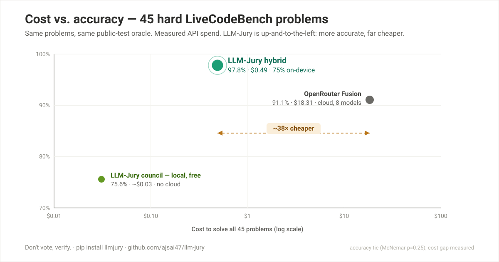

# LLM-Jury

[](https://pypi.org/project/llm-jury-verify/)
[](https://pypi.org/project/llm-jury-verify/)
[](https://github.com/ajsai47/llm-jury/actions)
[](#)
[](LICENSE)

[Quickstart](#quickstart) · [Claude ↔ Codex](#bidirectional-claude--codex-orchestration) · [Codex Fusion](#codex-fusion) · [How it works](#how-it-works) · [Benchmarks](#benchmarks) · [Write-up →](https://app.notion.com/p/3844834c4d7881d1adaeed9c3a81dcbb) · [Paper →](https://app.notion.com/p/3874834c4d78817f99a0fc26088ed7e4)

**Local verified answers. Don't vote, verify.**

A frontier API gives you one answer and asks you to trust it. LLM-Jury gives you an answer it can
**prove** — by running the tests — and does most of the work on your own laptop, for free.

It runs model-generated code through a real verifier and returns only what **provably passes** —
not the answer that got the most votes. The result: a council of small open models on your machine,
plus opt-in, verifier-gated cloud escalation for the hard minority. The benchmarked hybrid
**matches a commercial frontier-model fusion on hard code at ~38× lower cost.**

> **Measured head-to-head — 45 hard LiveCodeBench problems, same oracle** ([full numbers + methodology →](BENCHMARKS.md)):

| | Accuracy (n=45) | Cost | Solved locally |
|---|---|---|---|
| **LLM-Jury hybrid** — local council + 1 opt-in frontier escalation | **44/45 (97.8%)** | **$0.49** | 75% |
| OpenRouter Fusion — commercial frontier fusion | 41/45 (91.1%) | $18.31 | 0% |



**Same accuracy, ~38× cheaper.** LLM-Jury *matches* the commercial frontier fusion — a strict
superset, solving every problem it does plus 3 — for **$0.49 vs $18.31**, running 75% of problems
fully on your laptop and escalating only the hard minority to a single cloud call. *(The +3-problem
edge is a clean sweep but not statistically significant at n=45 — McNemar p = 0.25 — so read
accuracy as parity-or-better; the **cost gap is the decisive, measured win.**)*

And the local council **alone**, no cloud at all, already beats a frontier model's one-shot on hard
code — **75.6% vs 62.2%** on LiveCodeBench — and matches it on HumanEval+ (**97.6% vs 97.6%**).
Free, private, zero dependencies (stdlib only).

```bash
pip install llm-jury-verify   # zero dependencies, stdlib only
llmjury demo                 # 5-second offline demo — no API key, nothing to download
```

`llmjury demo` runs the real generate → verify → escalate pipeline on a canned task with a built-in
offline backend: a "weak" model returns a wrong answer, the verifier catches it, and the council's
answer passes. That's the whole product, offline.

> **⚠️ Security.** LLM-Jury *executes model-generated code* to verify it. The default
> `LLMJURY_SANDBOX=auto` provisions a throwaway Docker/Colima container with no network,
> dropped capabilities, a non-root user, and resource limits. If a container cannot start,
> it falls back to the hardened host runner and prints that fact. Use
> `LLMJURY_SANDBOX=docker` to require container isolation; never run as root.

---

## Quickstart

**CLI** (examples ship in the repo):

```bash
# functional tests (the body of a check(candidate) function)
llmjury solve --task examples/add_task.txt --tests examples/add_test.py --entry-point add

# or competitive-programming style (stdin/stdout cases as JSON)
llmjury solve --task examples/sum_stdin_task.txt --cases examples/cases.example.json

# hybrid: local council first, then a verifier-gated open-weight OpenRouter ladder
llmjury solve --task examples/sum_stdin_task.txt --cases examples/cases.example.json \
    --backend ollama --frontier auto   # needs OPENROUTER_API_KEY

# Codex-native hybrid: local council first, then the authenticated Codex CLI.
# No OpenAI API key is required; this reuses `codex login` / ChatGPT-managed auth.
llmjury solve --task examples/add_task.txt --tests examples/add_test.py --entry-point add \
    --backend ollama --frontier gpt-5.6-sol --frontier-backend codex

# Codex as the generation provider for every tier (single model, best-of-k).
llmjury solve --task examples/add_task.txt --tests examples/add_test.py --entry-point add \
    --backend codex --models gpt-5.6-sol
```

**Python:**

```python
from llmjury import solve, FunctionalCodeVerifier, OllamaBackend

task = "Write a function `add(a, b)` that returns the sum of two numbers."
tests = "def check(c):\n    assert c(2, 3) == 5\n    assert c(-1, 1) == 0\n"

# Local + free (needs Ollama running). Omit backend= to use the OpenRouter cloud
# backend instead — that one needs OPENROUTER_API_KEY set.
result = solve(task, FunctionalCodeVerifier(tests, entry_point="add"), backend=OllamaBackend())
print(result.verified)   # True
print(result.answer)     # def add(a, b): return a + b
print(result.stage)      # "single"  (escalates to "council" on hard problems)
```

**Bring your own tests** — skip the `check()` string entirely with `(args, expected)` pairs:

```python
from llmjury import FunctionalCodeVerifier
verifier = FunctionalCodeVerifier.from_cases("add", [((2, 3), 5), ((-1, 1), 0)])
```

(`--tests` also accepts either a full `def check(candidate): ...` or just its body. And
`llmjury solve --json` emits a machine-readable result for piping into CI/agents.)

## Bidirectional Claude ↔ Codex orchestration

LLM-Jury installs skills into both agent harnesses so the workflow works from either
side: Claude plans and reviews; authenticated Codex executes; the local Ollama council
assists only on code units with a trustworthy oracle.

```bash
llmjury install-claude
llmjury install-codex
```

Restart Claude Code and Codex after the first install so each discovers its skill.

```text
Start in Claude:  Claude plan → Codex execute ─┐
                                               ├→ tests/diff → done
Start in Codex:   Claude plan ← Codex request ─┘       │
                         ↑                              │ evidence changed
                         └──────── dynamic replan ──────┘

Within Codex execution: testable Python unit → local Ollama jury → verifier → integrate
```

### Starting in Claude Code

`install-claude` installs two entry points:

- **`llm-jury-fusion` agent** — a subagent that frames a verifiable task, derives the
  oracle, and drives `llmjury solve --backend ollama` itself. It deliberately carries
  no `model:` pin, so it inherits the session model and works in every Claude Code
  session type — terminal, the Claude desktop app's hosted sessions, and cron — with
  no dependency on a local model router or a custom `ANTHROPIC_BASE_URL`. (Sessions
  pinned to the official API, like the desktop app's, cannot resolve local-router
  model names; an unpinned agent sidesteps that entirely.)
- **`llm-jury-delegate` skill** — has Claude pass a bounded execution brief to Codex:

```bash
llmjury delegate --workspace "$PWD" --task - --json <<'TASK'
Implement the parser described in the current plan.

Scope: src/parser.py and tests/test_parser.py.
Acceptance: preserve the public API and make the focused parser tests pass.
Checks: python -m pytest tests/test_parser.py.
TASK
```

### Starting in Codex

The `llm-jury-orchestrate` skill automatically asks Claude to plan non-trivial
implementation work before Codex edits. Trivial one-step changes and explicit
“just execute” requests skip the extra planning call. The underlying command is:

```bash
llmjury plan --workspace "$PWD" --task - --json <<'TASK'
Implement resumable uploads without changing the public client API.
Include relevant repository constraints, acceptance criteria, and checks.
TASK
```

Claude runs with only read/search tools in plan permission mode and returns
schema-validated steps, file targets, acceptance criteria, risks, and blocking
questions. Codex executes those steps. If tests reveal a wrong assumption, the code
differs materially from the plan, scope must change, or repeated focused attempts
fail, Codex calls `llmjury plan` again with the original goal plus current evidence.
Claude returns only the remaining or corrective work, preserving already verified
progress.

`delegate` is a different security mode from the Codex generation backend:

- It runs an ephemeral Codex agent with `workspace-write` confinement in the one
  workspace Claude names.
- It keeps Codex user configuration and repository instructions enabled, so the
  executor reads the applicable `AGENTS.md` and `CLAUDE.md`.
- Shell commands receive Codex's minimal `core` environment by default instead of
  inheriting the caller's credential-rich environment.
- Codex returns a schema-validated handoff: status, summary, changed files, checks,
  and blockers. Claude remains responsible for inspecting the diff and final result.
- Destructive operations and permission bypasses are not exposed. Extra writable
  directories require an explicit repeatable `--add-dir` argument.

The delegation prompt allows Codex to call the existing local jury for an extractable
Python unit with functional tests or stdin/stdout cases. It does not ask local models
to vote on architecture or other uncheckable work. This preserves the project's core
rule: local model output becomes implementation input only after an independent
verifier accepts it.

Use `--scope project` to install the Claude skill in only the current repository, or
`--force` to replace a locally modified installed copy. Both installers are idempotent.

## Codex Fusion

The recommended Codex workflow keeps candidate generation local until the verifier proves
the local council needs help:

```text
Codex frames the task and oracle
  → Phi-4 on local Ollama
  → Gemma 3 12B + Llama 3.1 8B only if Phi-4 fails
  → DeepSeek V4 Flash on OpenRouter only if the local council fails
  → DeepSeek V4 Pro only if Flash also fails
  → return the first candidate that passes the oracle
```

Run that policy with:

```bash
export OPENROUTER_API_KEY="..."   # or store it in ~/.llmjury/.env
llmjury solve --task task.txt --tests tests.py --entry-point solve \
    --backend ollama --frontier auto --json
```

The distinction matters: **the council is local and private through Ollama; the DeepSeek
models are open-weight but remotely hosted through OpenRouter.** A task leaves the machine
only after every local candidate fails verification. The CLI prints the selected stage and
model, so an orchestrating Codex session can report when paid escalation actually occurred.

`auto` uses a capability ladder instead of guessing difficulty from task keywords. The
verifier is the router: Flash gets the first inexpensive recovery attempt, Pro receives only
the unresolved tail, and neither can introduce an accepted regression because its output must
pass the same tests.

To use authenticated Codex itself as the final provider instead of OpenRouter:

```bash
llmjury solve --task task.txt --tests tests.py --entry-point solve \
    --backend ollama --frontier gpt-5.6-sol --frontier-backend codex
```

That path reuses `codex login`, launches an ephemeral read-only generation session, ignores
repository rules and user configuration, and disables shell tools. Pin any explicit
OpenRouter slug with `--frontier <provider/model>` when reproducing a benchmark or comparing
a particular model.

## How it works

Three small models you can run for free on a laptop, plus a verifier, match or beat a frontier
model on verifiable work. The engine is a tiered pipeline that *gates fusion on the verifier*:

```
task + verifier
  → GENERATE   sample candidates across a cross-lineage small-model council
  → VERIFY     run the verifier on each (code = run the tests)
  → SELECT     return the one that provably passes
  → ESCALATE   one model first → add the council only when nothing passes
               → (optional) ordered frontier models only when earlier tiers fail
```

That tiered escalation is what keeps it laptop-friendly *and* lets it reach frontier-class
accuracy: the common case runs **one** model fast, hard problems load the full local council, and —
if you opt in with `--frontier` — the small hard minority the council can't verify escalates to a
cloud model or ordered ladder. You pay for cloud inference only on the problems that need it, and
each later model runs only when the earlier one still cannot produce a verified answer.

**The rule LLM-Jury is built on:** combining models helps *exactly when you can check the answer
cheaply and independently.* Code has a real oracle (run the tests), so the council wins. Tasks
with no oracle (open-ended reasoning) collapse to voting, where a council *hurts* — so there,
LLM-Jury uses the single best model. The verifier, not the model count, is what decides.

## Benchmarks

Full numbers behind the headline — the measured head-to-head on all 45 hard LiveCodeBench
problems, judged by the same oracle ([methodology + caveats](BENCHMARKS.md)):

| | Accuracy (n=45) | 95% CI | Cost | Local | Verified |
|---|---|---|---|---|---|
| **LLM-Jury hybrid** (council + 1 frontier escalation) | **44/45 (97.8%)** | [88%, 99.6%] | **$0.49** | ◐ | ✓ |
| OpenRouter Fusion (cloud) | 41/45 (91.1%) | [79%, 97%] | $18.31 | ✗ | ✗ |
| **LLM-Jury council** (small open council, local) | 34/45 (75.6%) | [61%, 86%] | **$0.031** · free local | ✓ | ✓ |

Stated honestly: the **cost** gap is measured and decisive; the **accuracy** edge (+3 problems, 0
losses) is a clean sweep on the sample but **not statistically significant** (McNemar p = 0.25 at
n=45) — so read it as parity-or-better, not a proven win. And we *gave Fusion a token-budget
advantage* on 5 problems it first truncated, which only helped it. "Correct" here means "passes the
public sample tests," and the escalated ~25% do leave the device. Full caveats — confidence
intervals, the public-test oracle, the fairness disclosure — are in [BENCHMARKS.md](BENCHMARKS.md).

The table reports the historical benchmark configuration: local council followed by a pinned
DeepSeek V4 Pro best-of-4 escalation. The newer `--frontier auto` Flash → Pro ladder is designed
to reduce the cost of the unresolved tail without weakening acceptance, but it should not be
read as a separately measured benchmark result until that exact policy is reproduced.

## Backends

- **Ollama (local, free, private)** — `--backend ollama`. Pull the council first:
  ```bash
  ollama pull phi4 && ollama pull gemma3:12b && ollama pull llama3.1:8b
  ```
- **OpenRouter (cloud)** — `--backend openrouter` (default). Set `OPENROUTER_API_KEY`.
- **Codex CLI (authenticated OpenAI provider)** — `--backend codex`, or use
  `--frontier-backend codex` after a local council. It runs ephemeral, read-only
  `codex exec` sessions and reuses the existing Codex login. The default model for
  this checkout is `gpt-5.6-sol`; set `LLMJURY_CODEX_MODEL` to change that default,
  or override it per invocation with `--models` or `--frontier`.
  Candidate-generation sessions disable Codex's shell tools as an additional guard
  against reading unrelated host files.
  Jury calls default to low reasoning effort because the independent verifier supplies
  the acceptance gate; Python callers can override `CodexBackend(reasoning_effort=...)`.

The frontier provider is explicit. `--frontier-backend openrouter` accepts OpenRouter
slugs and requires `OPENROUTER_API_KEY`; `--frontier-backend codex` accepts a model
available to the installed Codex CLI and uses Codex authentication. OpenRouter is not
coupled to Anthropic: any compatible OpenRouter model slug can be used.

`--frontier auto` is the recommended local-first policy. It keeps the cross-lineage
Ollama council first, then tries DeepSeek V4 Flash for a low-cost cloud recovery and
DeepSeek V4 Pro for the hard remainder. Every later tier runs only when all earlier
candidates failed the same oracle, so the faster model cannot lower accuracy. Pin a
slug instead when reproducing a historical benchmark or testing a specific model.

A diverse, cross-lineage panel (different labs → different mistakes) is the point. The defaults
are Phi-4 (Microsoft) + Gemma-3-12B (Google) + Llama-3.1-8B (Meta); swap your own in
`llmjury.panels` or by passing `panel=[...]` to `Engine`.

## Reproduce the benchmarks

```bash
llmjury reproduce humaneval            # bundled 25-problem slice
llmjury reproduce lcb --n 5            # quick check
llmjury reproduce lcb --backend ollama  # run it locally
```

It runs the council on a bundled benchmark slice and reports how many problems the single best
model solves versus what the diverse council adds on escalation — the "council adds coverage"
story, in one command. (The bundled slices are 25 problems each; the headline 97.6% / 75.6%
figures are the larger full runs from the write-up.)

## Status

`v0.1` — working engine, functional and stdin/stdout verifiers, auto-provisioned container
sandbox, Codex + Ollama + OpenRouter backends, verifier-gated frontier ladders,
bidirectional Claude/Codex orchestration, and `llmjury reproduce`. Next: more verifier
types and benchmark runs for adaptive routing policies.

## License

MIT © The AI Collective
